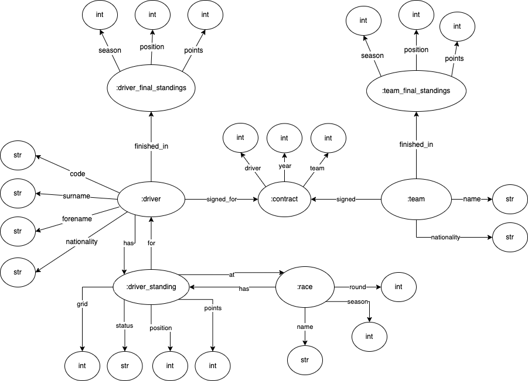

# WS First Project

The objective of this project was to develop an information system based on web. Its purpose is to display and manage all the information in the system.
The theme we chose for this project was Formula 1.

## Course
This project was developed under the [Web Semantic](https://www.ua.pt/en/uc/6496) course of [University of Aveiro](https://www.ua.pt/).

## Technologies

The following libraries were used in the development of the project:
* Django
* RDF (N3)
* Triplestore GraphDB
* SPARQL

## DB Diagram

    

## How to Run

1. Install the requirements on the `/f1_app` directory:
     
     python3 -m pip install -r requirements.txt

2. Initialize *GraphDB*, create a new repository "db" and import the file `f1.nt` present in the `datasets` directory:

3. Inside the `/f1_app` directory, execute the following command:

    python3 manage.py migrate

4. Finally, to start the app, run the following command, also inside the `/f1_app` directory:

    python3 manage.py runserver

> **_Note_**: To create an admin user, run the following command: `python3 manage.py createsuperuser`

## Demo

The demo can be found at the root folder of this repo.

## Grade 
This project's grade was **17** out of 20.

## Authors
* **Carina Neves**: [carinaneves15](https://github.com/carinaneves15)
* **Eduardo Santos**: [eduardosantoshf](https://github.com/eduardosantoshf)
* **Pedro Bastos**: [bastos-01](https://github.com/bastos-01)